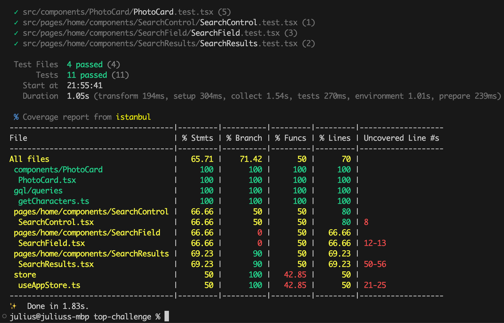

# React + TypeScript + Vite

Steps to run locally:

1. `git clone` using `HTTPS` or `SSH`
2. `cd top-challenge` and then type `yarn install`
3. type `yarn run dev` to start the application locally
4. `yarn run coverage` to execute tests and view coverage

See live [demo](https://poetic-jelly-b13731.netlify.app/)

or click [https://poetic-jelly-b13731.netlify.app/](https://poetic-jelly-b13731.netlify.app/)

Test Coverage

